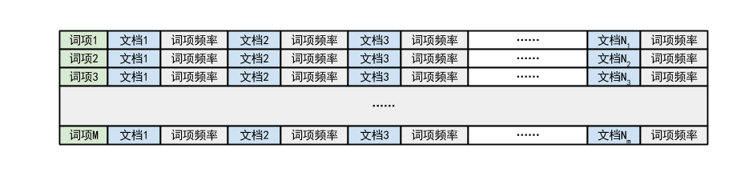
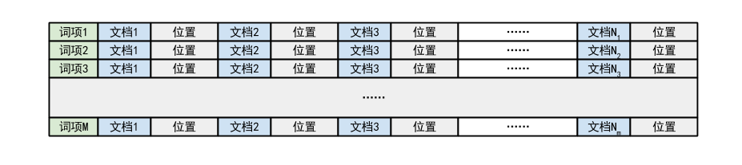
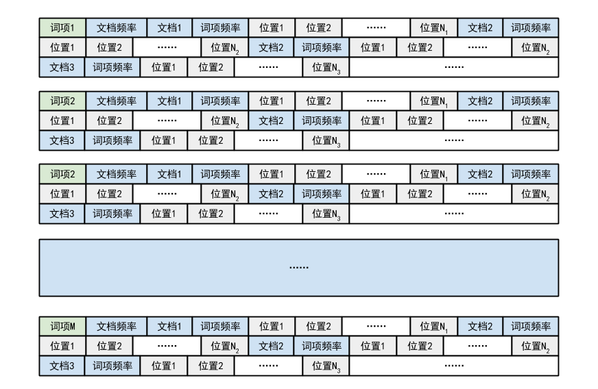

# 简单文本搜索引擎
## 1 简述
简单的文本搜索引擎，以路透社一段时间内的新闻作为文档集。

## 2 实现细节
### 2.1 索引构建
索引部分一共包括三个表。

#### 2.1.1 `HashMap<String, ArrayList<TermFreqItem>>` 倒排索引表
用哈希表的方式存储，每个`term`对应一个数组，其中按照`docID`顺序存储`term`出现的频率。需要取`tf`值时，仅需根据`term`的哈希值找到对应的数组，然后顺序查找到相应的`docID`，返回与`docID` 存储在一起的词项频率即可。需要取`df`值时，则需要调用Java的`size()`函数计算term对应的数组的长度，并以此作为`df`值。

#### 2.1.2. `HashMap<Integer, Double> additionalGrade`
`additionalGrade`保存针对查询文档集特征进行的修正参数。`additionalGrade`使用一个哈希表存储，键值为文档ID，对应该文档的修正参数。

#### 2.1.3. HashMap<Integer, Double> docLength
`docLength`保存文档的长度，使用一个哈希表存储。键值为ID，对应该文档的长度。

### 2.2 检索
#### 2.2.1 词项解析
首先对整个文档以空格划分，对每个划分出来的元素基于如下规则进行解析：

- 如果出现“/”符号，并且没有出现字母，则将该元素作为一个词项，如果出现字母，则将“/”两边作为两个词项处理  
- 如果出现数字但没有出现“/”符号，并且没有出现字母，则将该元素作为一个词项，如果出现字母，则将元素按照非数字或者字母的字符分割开，分别作为词项，同时将整个元素作为词项  
- 如果出现字母但是没有出现数字或者“/”符号，则将该元素按照非数字或字母的字符分割开，分别作为词项，同时将整个元素作为词项  

#### 2.2.2 倒排表构建
对于解析出来的所有词项，依次加入倒排表。同时，将两个相邻的词项中间加上空格，生成一个新的词项，作为双词处理。针对查询文档集特征进行的修正参数基于人工验证和经验。对于词项数量大于80个的文档，将其最终的检索结果加0.04作为修正；对于文章内词项数量/词条数量大于2.2的文档，将其最终的检索结果加0.13作为修正。这些做法针对文档集中少量短但没有信息量，以及仅包含两个重复的标题的垃圾文档而设计。

#### 2.2.3 基于关键词的检索
对于输入的检索关键词，首先采用先前描述的词项解析方法解析成词项，将其装入一个哈希表作为检索向量。对于检索向量中包含的词项，分别找到不同文档中对应的词项，以其`tf`值构成文档向量，并根据两个向量的tf-idf值结合修正值计算两个向量的余弦夹角。
在查找文档中是否存在某词项时，我们定义了一个`cursor`值。由于倒排索引表是按照`docID`顺序构建的，所以`cursor`只需要记录对于某个词条，前一次查找到了哪个文档。如果当前文档包含该词条，则`cursor`向前移动一位，否则不移动。
根据获得的所有文档的余弦值进行降序归并排序，在返回结果时返回位于排序后的结果列表的前几个即可。

### 2.3 索引压缩
为了节省索引空间，使用γ编码实现倒排索引压缩。γ编码的优点就是前缀无关，且保证了一定的压缩比。未压缩的索引结构将词项频率和文档位置索引分开存储。具体结构如下图

首先将索引结构进行精简整理，省去不必要记录的内容，如某个词项在同一个文档中的所有位置索引只需记录一个文档ID即可，不必每条索引都记录。记录文档ID时使用间隔编码，记录当前文档ID和上一个文档ID的差值，减少存储。整理后的索引结构如下

使用γ编码将以上结构压缩为二进制编码。经测试Reuters文档集生成的索引，经压缩后大约的到了16.7MB的索引文件。

### 2.4 布尔检索
#### 2.4.1 实现思路
这里使用的布尔检索实现方式较为简单，主要分为两个步骤

1. 读入检索关键词，对关键词进行parse
  - 对布尔操作符的优先级设定为 括号 > NOT > AND和OR，从左至右  
  - 读入关键词后，将布尔操作符以外的检索关键词大小写统一为小写，并且，将括号与单词分隔开，都作为token放在数组中，以便接下来的操作  
1. 使用深度优先搜索，对关键词进行倒排索引表的操作
  对前一步中清理好的token，依次读取，处理分为三种情况：
   1. token为布尔操作符，设置相关op  
   1. token为检索词。若op未设置，则将token的倒排表作为当前的result；否则，根据op对当前result和token进行合并或其他操作  
   1. token为括号。若为左括号，则当前op、result等保持不变，dfs进入进入下一层。若为右括号，dfs返回上一层，并将result与上一层的result进行相关操作  

#### 2.4.2 接口
- 使用接口：布尔检索与基本检索使用的基本一致。使用`TermFreqItem`的对象记录单个item以及调用`TermForm`的相关函数获取倒排索引表  
- 提供接口：`BoolRetrieval`类，创建一个该类的对象，并调用其函数`processRetrieval()`即可进入布尔检索模块  

#### 2.4.3 数据结构
主要使用的数据结构为`ArrayList`和`HashMap`。
- `HashMap`用来记录倒排索引表  
- `ArrayList`主要用来存储记录操作的过程中一些结果，如parse出来的关键词token，过程中的倒排表合并结果  

### 2.5 基于Porter算法的词干提取功能
#### 2.5.1 算法概述
Porter是目前stemming功能实现应用最广的算法之一，通过提取词干，可以将因为名词复数或动词时态而形态不同的同一单词同一起来，应用在搜索引擎中，可以提高检索的召回率，从而提升搜索引擎性能。需要说明的是，这个算法并不是将变形的单词还原成器基本单词，而是使用特定的方法将其一类单词变为统一的某一种形式。所以在我们实现检索工具的时候，首先将文档的单词都按照本算法规则变形，再在搜索时将关键字作同样处理即可。

#### 2.5.2 算法步骤
__主要分为5个步骤来使用替换__

1. 处理复数和过去/现在分词。如，SSES->SS、IES->I、S->(空)、ED->(空)、ING->(空)等规则，用以处理诸如caresses->caress、ponies->poni、cats->cat、motoring->motor等词  
1. 通过转换处理常见的带有双后缀的单词，去掉一个后缀，将其统一化，ATIONAL->ATE、IZATION->IZE、IVENESS->IVE、ENTLI->ENT等，用以处理诸如relational->relate、conditional->condition、digitizer->digitize、predication->predicate等  
1. 去掉一部分常见的形容词、名词词尾，如ICATE->IC、ATIVE->(空)、ALIZE->AL、FUL->(空)、NESS->(空)，用以处理formative->form、formalize->formal、electrical->electric、hopeful->hope、goodness->good等词  
1. 进一步去掉前部分辅音/元音字母有影响的形容词、名词词尾，如AL、ANCE、ENCE、ER、 ANT、MENT  allowance->allow用以处理inference->infer、adjustable->adjust、irritant->irrit、dependent->depend、effective->effect等词。去除另一些形式的形容词、名词词尾  
1. 在前四步的基础上按实际情况进行部分微调如E->(空)：probate->probat  

#### 2.5.3 实现思路
__一些基本定义__
- `cons(i)`：判断辅音。当i为辅音时，返回真；否则为假  
- `m()`：表示单词b介于0和j之间辅音序列的个度  

假设c代表辅音序列，而v代表元音序列。<..>表示任意存在。于是有如下定义

    <c><v>结果为0
    <c>vc<v>结果为1
    <c>vcvc<v>结果为2
    <c>vcvcvc<v>结果为3

__基本工具函数__
- `vowelinstem()`：表示单词`b`介于`0`到`i`之间是否存在元音  
- `doublec(j)`：参数`j`：`int`型；表示在`j`和`j-1`位置上的两个字符是否是相同的辅音  
- `cvc(i)`：参数`i`：`int`型；对于`i`，`i-1`，`i-2`位置上的字符，它们是“辅音-元音-辅音”的形式，并且对于第二个辅音，它不能为w、x、y中的一个。这个函数用来处理以e结尾的短单词。比如说`cav(e)`，`lov(e)`，`hop(e)`，`crim(e)`。但是像snow，box，tray就辅符合条件  
- `ends(s)`：参数：`String`；判断`b`是否以`s`结尾  
- `setto(s)`：参数：`String`；把`b`在`(j+1)`...`k`位置上的字符设为`s`，调整`k`的大小  
- `r(s)`：参数：`String`；在`m()>0`的情况下，调用`setto(s)`  

__分步处理函数__

按上述的步骤依次对单词进行层层分析

    Step1()：判断ends(s),然后处理单复数以及动词ed/ing形态，顺便vowelinstem()，对于有元音又以Y结尾的单词改y为i
    Step2()：对于m>0的双后缀单词，去除一个后缀；
    Step3()：与step2类似，去除常见单词后缀；
    Step5()：在<c>vcvc<v>情形下，去除-ant，-ence等后缀。
    Step6()：在m()>1的情况下，移除末尾的“e”。

#### 2.5.4 数据结构
通过创建一个`TermStem`的类，将待处理单词传递进去，调用构造函数，最终返回词干提取后的单词。调用方式

    TermStem termstem=new TermStem("stopped")

`termstem.stemmed`即为返回结果。程序的实现主要依赖一些列字符串处理，按情况讨论各种单词形态，一一分析处理即可。

## 3 测试运行
    java -jar ReutersRetrieval.jar
